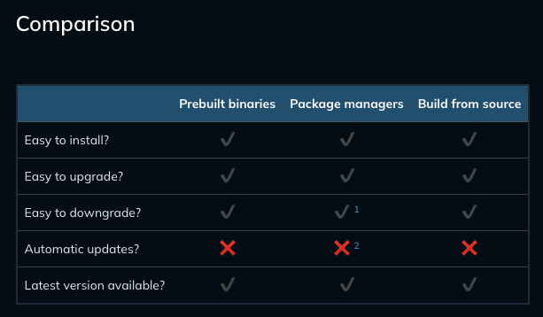
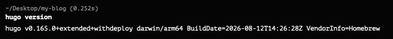
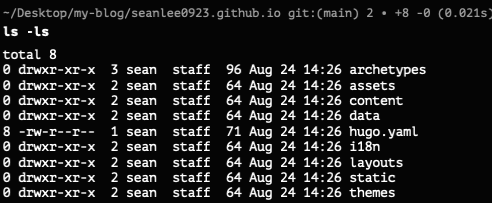
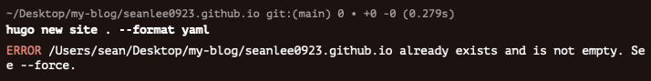
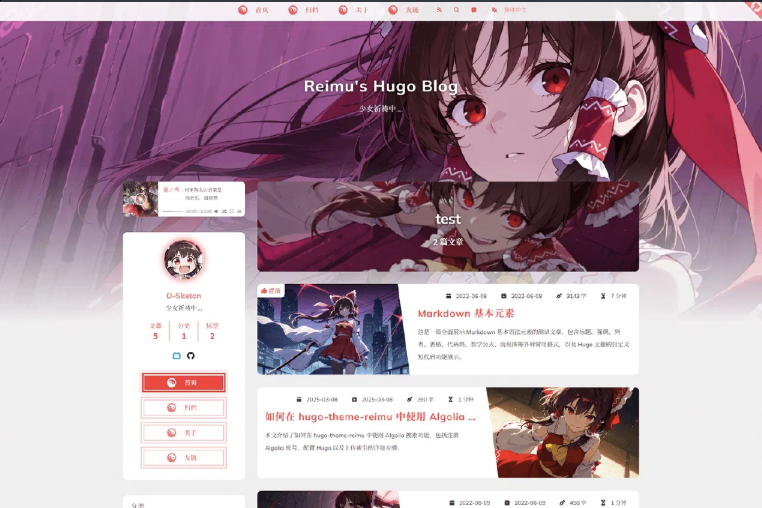
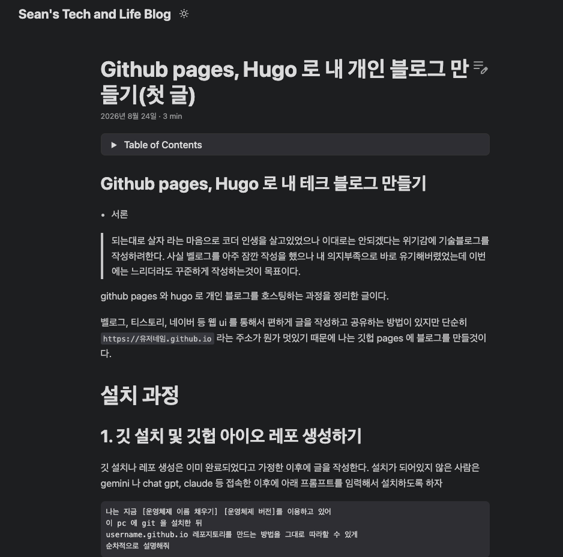
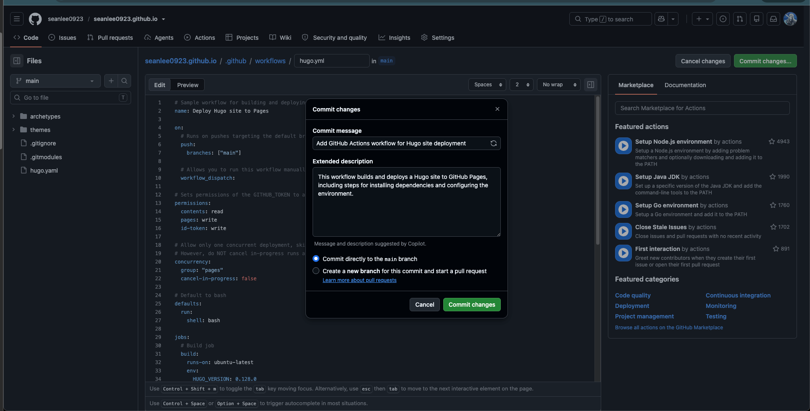
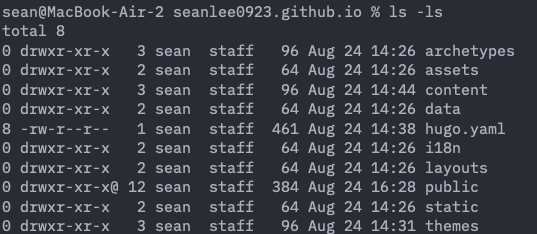

## Github pages, Hugo 로 내 테크 블로그 만들기
- 서론

> 되는대로 살자 라는 마음으로 코더 인생을 살고있었으나 이대로는 안되겠다는 위기감에 기술블로그를 작성하려한다.
사실 벨로그를 아주 잠깐 작성을 했으나 내 의지부족으로 바로 유기해버렸었는데 이번에는 느리더라도 꾸준하게 작성하는것이 목표이다.


github pages 와 hugo 로 개인 블로그를 호스팅하는 과정을 정리한 글이다.

벨로그, 티스토리, 네이버 등 웹 ui 를 통해서 편하게 글을 작성하고 공유하는 방법이 있지만 
단순히 `https://유저네임.github.io` 라는 주소가 뭔가 멋있기 때문에 나는 깃헙 pages 에 블로그를 만들것이다.

# 설치 과정

## 1. 깃 설치 및 깃헙 아이오 레포 생성하기 
깃 설치나 레포 생성은 이미 완료되었다고 가정한 이후에 글을 작성한다. 
설치가 되어있지 않은 사람은 gemini 나 chat gpt, claude 등 접속한 이후에 아래 프롬프트를 임력해서 설치하도록 하자

```
나는 지금 [운영체제 이름 채우기] [운영체제 버전]를 이용하고 있어
이 pc 에 git 을 설치한 뒤
username.github.io 레포지토리를 만드는 방법을 그대로 따라할 수 있게 
순차적으로 설명해줘
```

## 2. hugo 설치 
나는 현재 mac os (m2) 를 사용하고 있기때문에 맥 os 를 기준으로 설명한다. 

hugo 문서 사이트에 접속해서 quick start 를 보고 본인의 운영체제와 환경에 맞게 설치하면 된다.

[휴고 install guide](https://gohugo.io/installation)

맥포트, brew, 혹은 직접 클론하고 빌드해서 사용할 수 있다.

나는 brew 를 사용해서 설치를 했다. 
이유는
1. 설치가 편하다 
2. 업데이트가 편하다

어떤 방식을 사용할지는 아래 표를 보고 본인에 상황에 맞게 설치하면 된다. 
(계속 선택을 독자에게 넘기는것 같지만 나도 설치할때마다 방법이 달라질수 있어 이렇게 선택지를 자유롭게 쓰는것이 참고에 도움이 될거라 판단했다.)


brew 로 hugo 설치하는 명령어
```zsh
brew install hugo
```
위 명령어로 설치 이후 아래 명령어 입력시 버전이 나오면 설치된것이다.

```zsh
hugo version
```


## 3. 레포지토리 클론 및 hugo 사이트 생성하기

github.io 레포지토리를 클론한 후에 사이트를 만들면 된다.


```zsh
# 레포지토리 클론
git clone [유저네임].github.io
# 레포지토리 디렉토리로 이동
cd [유저네임].github.io
# 휴고 사이트 생성 명령어
hugo new site . --force --format yaml
```

init 이 완료되면 아래처럼 디렉토리랑 파일들이 생긴다.



> 여담
처음 init 하는거라 force 옵션이 필요없지 않을까 했는데 에러가 뜬다.
--force 랑 같이 입력하자


## 4. 테마 설치하기 (선택)

사이트 생성시 배포된 테마들을 이용할 수 있다.

[Hugo Thmes](https://themes.gohugo.io/)

나는 [PaperMod](https://themes.gohugo.io/themes/hugo-papermod) 라는 테마를 설치했으며 이유는 다음과 같다.

1. 깃헙에 별이 많다.
2. 업데이트를 지속적으로 하고있다.
3. 뭔가 전문적으로 보인다.(기술블로그로 이용할 예정이라 좀 튀지 않는 테마를 선택했다.)


아래 명령어를 사용해서 테마를 설치하자

```zsh
git submodule add --depth=1 https://github.com/adityatelange/hugo-PaperMod.git themes/PaperMod
```

themes 디렉토리 확인해보면 PaperMod 가 생겼다.
이 커스터마이징은 직접 수정하는것보다 이후에 layouts/ 랑 assets/ 같은 경로에서 다시 작성하는것이 좋다. (페이지 깨짐 방지, 업데이트 지속적으로 받기 위해서)

아래 테마가 마음에 들었으나 기술블로그 테마로는 사용하기 어려울것 같아서 포기했다.(글들이 좀 쌓이면 테마를 직접 만들어 보는것도 좋을것같다.)


[레이무 테마](https://themes.gohugo.io/themes/hugo-theme-reimu/)
동방프로젝트의 하쿠레이 레이무 테마인데 기술블로그 테마를 찾다가 보니 뭔가 반갑다.

## 5. hugo.yaml 파일을 설정하기

vim, nano, vscode, zed 등등 편한 방식을 사용해서 hugo.yaml 파일을 수정한다.

나는 vim 을 사용했고 이유는 따로 ide창을 따로 키는게 귀찮아서 터미널에서 vim 으로 수정했다.
```yaml
# 유저네임.github.io 입력
baseURL: https://seanlee0923.github.io/
# 한국, 한글
locale: "ko-kr"
# 블로그명 입력
title: "Sean's Tech and Life Blog"
# theme 에다가 방금 설치한 테마 이름 입력
theme:
  - PaperMod
# 타임존 입력 (UTC 가 편한 사람은 utc 로 사용하면 됨"
timeZone: "Asia/Seoul"
enableRobotsTXT: true

params:
  defaultTheme: auto
  ShowReadingTime: true
  ShowCodeCopyButtons: true
  ShowToc: true
```

## 6. yaml 파일 작성이 되었으면 글을 작성하자
아래 명령어 사용해서 글용 마크다운 만들기
```zsh
hugo new content posts/[게시글 제목]/index.md
```

위 명령어를 입력하면 
contents/posts/제목 
디렉토리가 생성되고 아래에 index.md 마크다운 파일이 생성된다.

index.md 파일의 --- 으로 나눠진 섹터를 수정한 뒤 마크다운 형식으로 문서를 작성한다 

```text
---
title: "제목으로 쓸 말"
date: 2026-08-24T14:00:00+09:00
draft: true
tags:
  - Hugo
  - GitHub Pages
  - GitHub Actions
---
```

여기서 중요한 값은 `draft: true` 이다.
draft 가 true 인 경우 아직 작성중이라는 뜻이며 작성이 완료되면 false 로 바꾸면 된다.

## 7. 로컬에서 블로그 띄우기

repository 의 루트 위치에서 아래 명령어를 실행한다
```zsh 
hugo server -D 
```
이 명령어에서 D 옵션은 아직 작성중인(draft 상태인) 글도 표시한다는 뜻이다.

기본포트로는 1313번 포트를 사용하며 
[https://localhost:1313](https://localhost:1313)
로 들어가면 본인이 작성중인 글을 미리볼수 있다.



또 마크다운 파일이 수정될때마다 새로 빌드되어서 새로고침 할때마다 바로바로 어떤 식으로 보이는지 보인다.(spring 쓸때 devtools 나 리액트 프로젝트를 run dev 로 돌린것처럼 바로바로 업데이트가 됨)

## 8. 블로그 작성 이후 깃 업데이트
루트 경로에 `.gitignore` 파일 생성 후 아래 내용 입력

```
/public/
/resources/_gen/
.hugo_build.lock
```

## 9. 커밋 진행

로컬 환경에서 셋팅이 완료되었다면 첫 커밋을 진행하면 된다. 

```zsh
git add .
# 커밋 메시지는 원하는대로 수정하면 됨
git commit -m "initialize Hugo tech blog"
# 커밋 이후 Push
git push origin main
```

## 10. Github Pages 켜기

레포지토리를 만들었으면 이제 레포지토리의 설정, pages 로 가서 github actions 를 활성화 한다.

레포지토리의 Settings -> Pages -> github actions 선택


이후 browse all workflows 링크를 클릭한 뒤에 hugo 를 검색해서 선택.

이후 HUGO_VERSION 을 0.165.0 로 업데이트 한 이후 메인에 커밋하면 된다.(테마때문에 최신 버전을 사용해야 빌드에 성공한다.)


## 11. 이제 작성이 완료된 글을 실제로 배포를 진행하면 된다.

마크다운 파일 상단의 draft 상태를 false 로 업데이트 한 이후 저장한다.

```zsh
hugo server
```
를 실행하여 public 이 정상적으로 생기는지 로컬에서 확인한다.



## 12. 빌드가 확인되었으면 이제 커밋 후 push 하면 된다.

```zsh
git add .
# 마찬가지로 커밋 메시지는 원하는대로 작성하면 된다
# 나는 Post: title 형식을 사용했다.
git commit -m "Post: Github pages, Hugo 로 내 개인 블로그 만들기(첫 글)"
git push

```

## 13. 설치 및 깃헙 액션 구성 완료

설치 및 깃헙 액션까지 구축이 완료되었다.
이제 앞으로 새 글을 작성하려면 아래 명령어를 입력 후 md 작성이 완료될때마다 push 하면 알아서 글이 올라가진다.

```zsh
hugo new content posts/[작성할 글 이름]/index.md
```
