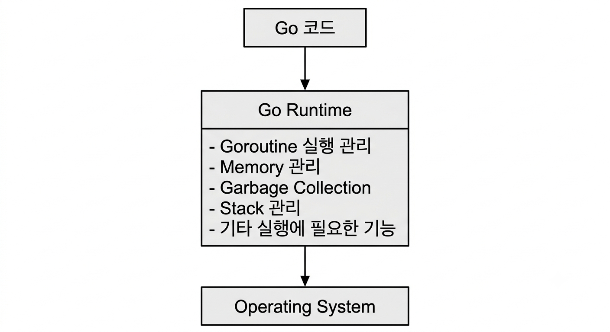
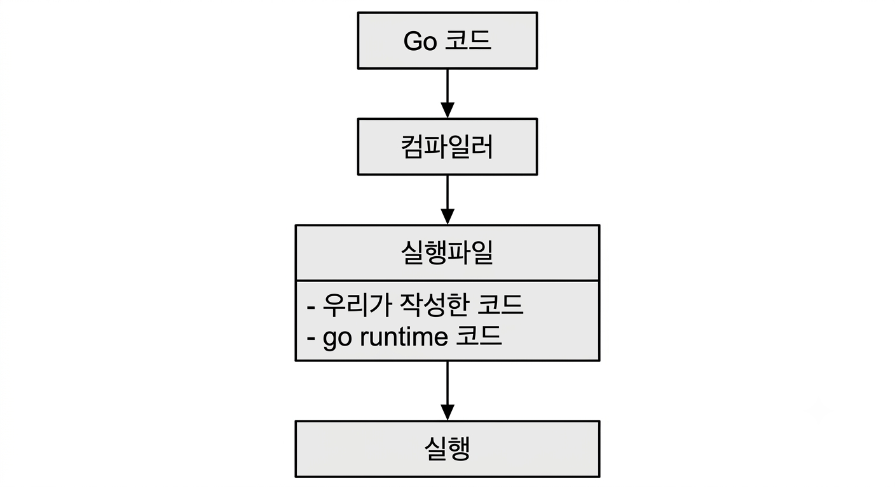
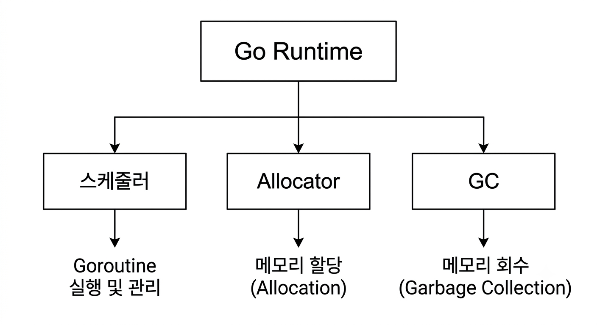

#### 서론

중요! 이 글은 1.27.0 버전을 기준으로 작성한 글이다.

[1.27.0 버전 릴리즈 노트](https://go.dev/doc/go1.27)

[소스코드](https://github.com/golang/go/tree/go1.27.0)

Go 를 공부하다보면 자연스럽게 다음과 같은 단어들을 접하게 된다.
- 고루틴
- 고루틴 스케줄러
- G-M-P 모델
- 가비지 컬렉터

각각 독립적인 기능처럼 보이지만, 실제로는 대부분 go runtime 과 밀접하게 관련되어있다.

아래 코드를 살펴보자.

```go
package main

import "fmt"

func main() {
	fmt.Println("Hello World!")
}
```

이 코드만 보면 단순히 main() 함수에서 시작해 문자열을 출력하고 종료되는것처럼 보인다.

하지만 실제 프로그램이 동작하기 위해서는 보이지 않는 꽤 많은 작업들이 필요하다. 

런타임을 초기화 하고, 고루틴을 실행할 스케줄러를 준비해야 하고, 프로그램에서 사용할 메모리를 관리하고, 가비지 컬렉터도 준비해야한다. 

우리가 작성한 코드 뒤에서는 go runtime 이 프로그램 실행을 위한 여러가지 작업들을 담당하고 있다. 

이번 글에서는 go runtime 이 무엇인지를 간단히 정리한다.

## 1. Go Runtime 이란?

우선 런타임이 무엇인지를 알아보자.
런타임은 프로그램이 실행되는 동안 프로그램의 동작을 지원하고, 관리하는 코드와 기능들의 집합이다. 

우리가 작성한 프로그램은 cpu 에서 명령어만 순서대로 실행한다고 끝나는것이 아니다. 메모리를 할당해야할수도 있고, 여러 작업들을 동시에 실행해야할수도 있으며, 더이상 안쓰는 메모리를 지워야 할수도 있다. 

Go 에서는 이런 작업 대부분을 Go Runtime 이 담당한다. 

대표적으로 Go Runtime은 다음과 같은 일을 한다. 

- Goroutine을 어떤 OS의 쓰레드에서 실행할지 관리한다.
- 프로그램이 필요로 하는 메모리를 할당한다.
- 더 이상 사용하지 않는 메모리를 가비지 컬렉터를 통해 회수한다.
- Goroutine의 Stack을 관리한다.
- 타이머, 네트워크 I/O 등 프로그램 실행에 필요한 여러 기능을 지원한다.

아주 단순하게 표현하면 다음과 같다.


go 코드를 빌드하게 되면 작성한 코드뿐만 아니라 프로그램 실행에 필요한 Runtime 코드 역시 실행파일에 함께 포함된다. (빌드 대상 플랫폼의 native machine code 로 컴파일 되며, 프로그램 실행에 필요한 런타임 코드가 실행 파일에 함께 링크가 된다.)

그래서 개발자가 직접 Runtime을 실행하거나 관리하지 않아도 프로그램이 실행되면 Runtime 역시 함께 동작한다.



아래 코드로 고루틴을 생성한다고 해보자.
```go
go doFunc1()
````

작성한 것은 go 키워드 하나지만, 실제로 이 goroutine을 실행하려면 여러 작업이 필요하다.
어떤 goroutine이 실행 가능한 상태인지 관리해야 하고, 사용할 OS Thread를 정해야 하며, 여러 goroutine 사이에서 CPU 실행 시간을 적절히 나누어야 한다.
이러한 작업을 개발자가 직접 구현하지 않아도 되는 이유가 Go Runtime이 이를 대신 처리해주기 때문이다.

Go Runtime은 간단하게

`Go 프로그램이 실행되는 동안 Goroutine, Memory, GC 등 프로그램 실행에 필요한 여러 기능을 관리하는 Go의 내부 실행 시스템` 

이라고 이해했다.

## 2. Go Runtime 은 무슨 일을 할까?

Runtime이 담당하는 일은 굉장히 많다.

우선 크게 다음 세 가지를 중심으로 이해해보려고 한다.



이 세 가지는 서로 독립되어 있는 것이 아니라 연결되어 있다.

프로그램을 실행하면 goroutine이 실행된다.

```text
Goroutine
    ↓
Scheduler
    ↓
실행
```

프로그램이 실행되는 동안 객체가 필요하면 메모리를 할당한다.

```text
프로그램
   ↓
Memory Allocation
   ↓
Heap
```

그리고 더 이상 사용하지 않는 객체들이 생기면 Garbage Collector가 이를 찾아 메모리를 다시 사용할 수 있도록 만든다.

```text
Heap
  ↓
Garbage Collector
  ↓
사용하지 않는 객체의 메모리 회수
```

그래서 이번 시리즈도 이 흐름을 따라가려고 한다.

```text
Runtime
   ↓
Goroutine Scheduler
   ↓
Memory Allocator
   ↓
Garbage Collector
```

### Goroutine Scheduler

Go의 대표적인 특징 중 하나는 goroutine이다.

```go
go func() {
	fmt.Println("hello")
}()
```

goroutine은 OS의 쓰레드와 동일하지 않다.

하나의 프로그램에는 아주 많은 goroutine이 존재할 수 있고, Go Runtime은 이 goroutine들을 OS 쓰레드 위에서 실행해야 한다.

이 역할을 담당하는 것이 *Goroutine Scheduler*다.

Go Runtime 문서에서는 scheduler가 관리하는 핵심 자원을 `G`, `M`, `P`로 설명한다

(runtime/proc.go 의 25번째 줄에 있는 주석)
```go
// Goroutine scheduler
// The scheduler's job is to distribute ready-to-run goroutines over worker threads.
//
// The main concepts are:
// G - goroutine.
// M - worker thread, or machine.
// P - processor, a resource that is required to execute Go code.
//     M must have an associated P to execute Go code, however it can be
//     blocked or in a syscall w/o an associated P.
//
// Design doc at https://golang.org/s/go11sched.
```

- **G**: Goroutine
- **M**: OS Thread
- **P**: Go 코드를 실행하는 데 필요한 리소스 

Scheduler는 이 세 가지를 적절하게 연결하여 goroutine이 실행될 수 있도록 한다. 

```text
      G
      │
      P
      │
P를 획득한 M
      │
      M
      │
      CPU
```

물론 실제 동작은 이것보다 훨씬 복잡하다.

Local Run Queue, Global Run Queue, Work Stealing, Network Poller 등 여러 요소가 함께 동작한다.

이 실제 동작의 경우 이후에 
`runtime/proc.go`를 직접 분석하면서 글을 작성하도록 하겠다.

---

### Memory Allocator

프로그램을 실행하다 보면 계속해서 새로운 값과 객체가 만들어진다.

예를 들어 다음 코드를 생각해볼 수 있다.

```go
type User struct {
	Name string
	Age  int
}

func createUser() *User {
	return &User{
		Name: "gopher",
		Age:  10,
	}
}
```

어떤 값은 stack에서 관리할 수 있지만, 어떤 값은 heap에 존재해야 한다.
(이 글에서는 단순 예시를 위해서 이런 코드를 사용했지만 이 코드를 보고 자바처럼 유저 객체는 힙으로 가고 스택에 그 데이터 가리키는 값이 저장된다고 생각하면 안된다...)

Heap에 객체를 저장하려면 당연히 사용할 메모리를 어딘가에서 확보해야 한다.

이 역할을 담당하는 것이 **Memory Allocator**다.

Go Runtime의 메모리 할당 구조를 아주 단순화하면 다음과 같이 볼 수 있다.

```text
Allocation
    │
    ▼
  mcache
    │
    ▼
 mcentral
    │
    ▼
  mheap
    │
    ▼
    OS
```

Go의 `runtime/malloc.go`를 보면 allocator의 주요 자료구조로 `mcache`, `mcentral`, `mheap`, `mspan` 등이 등장한다.

특히 작은 객체의 일반적인 할당에서는 먼저 P가 가지고 있는 `mcache`를 확인하고, 필요한 공간이 없다면 `mcentral`, 이후 `mheap` 쪽에서 공간을 확보하는 계층적인 구조를 사용한다. 

물론 위 그림만 보고

> 모든 메모리 할당이 항상 정확하게 `mcache → mcentral → mheap → OS`를 순서대로 호출한다.

라고 이해하면 안 된다.

객체 크기나 현재 allocator 상태 등에 따라 실제 경로는 달라질 수 있다.

우선은

> **Go Runtime에는 메모리 할당을 효율적으로 처리하기 위한 자체적인 Memory Allocator가 있다.**

라는 사실만 우선 이해하고 넘어가자.

이 내용 또한 이후 `runtime/malloc.go`를 분석하며 살펴볼 예정이다.

Go 1.27에서는 특히 작은 객체에 대해 크기별로 특화된 메모리 할당 루틴을 컴파일러가 사용할 수 있도록 하는 최적화도 추가되었다. 따라서 메모리 allocator의 실제 구현은 Go 버전에 따라 계속 변화할 수 있다. 

---

### Garbage Collector

메모리를 할당하기만 하고 다시 사용할 수 없게 된다면 어떻게 될까?

프로그램을 오래 실행할수록 사용하는 메모리가 계속 증가할 것이다.

그래서 Go Runtime에는 **Garbage Collector(GC)**가 존재한다.

GC의 역할을 아주 단순하게 표현하면

> **더 이상 사용할 수 없는 heap 객체를 찾아 해당 메모리를 다시 사용할 수 있도록 만드는 것**

이라고 할 수 있다.

예를 들어 다음과 같은 형태로 생각해볼 수 있다.

```text
Heap Objects
     │
     ▼
현재 프로그램에서
도달 가능한가?
   /      \
 Yes       No
  │         │
유지      회수 대상
```

Go의 GC는 현재 **concurrent mark-and-sweep** 방식을 기반으로 하며, 프로그램 실행과 동시에 GC 작업을 진행할 수 있도록 구성되어 있다.

또한 write barrier를 사용하고, non-generational, non-compacting GC라는 특징을 가지고 있다. `runtime/mgc.go` 파일의 시작 부분에서도 이러한 특징과 전체 GC 단계를 설명하고 있다.

처음부터 GC 내부 알고리즘을 모두 이해하기는 어렵기 때문에 여기서는

```text
객체 할당
   ↓
Heap
   ↓
사용 여부 판단 (Mark)
   ↓
사용하지 않는 영역 회수 (Sweep)
```

정도의 큰 흐름만 기억하면 충분할 것 같다.

가비지 컬렉터의 동작 방식에 대한 정리는 
`runtime/mgc.go`, `runtime/mgcmark.go` 등을 직접 분석한 이후 정리하겠다. (정리할 글들이 점점 쌓인다.)


## 3. Go 프로그램은 어떻게 시작될까?
Runtime의 역할을 대략 살펴봤다면 한 가지 궁금한 점이 생긴다.

우리가 작성한 프로그램은 정말 `main.main()`부터 실행되는 걸까?

```go
package main

func main() {
	println("Hello")
}
```

코드의 입장에서는 `main()`이 시작점처럼 보인다.

하지만 실제 프로세스가 시작하자마자 곧바로 사용자가 작성한 `main.main()`이 호출되는 것은 아니다.

그 전에 Runtime이 먼저 프로그램을 실행할 준비를 해야 한다.

Go 1.27의 `runtime/proc.go`에는 Runtime bootstrap 과정이 주석으로 정리되어 있다.
(schedinit() 함수 위에 존재하며, 836번째 줄부터 참고하면 된다.`osinit`, `schedinit` 이후 새로운 G를 생성하고 해당 G가 `runtime.main`을 호출한다는 내용.)

```go
// The bootstrap sequence is:
//
//	call osinit
//	call schedinit
//	make & queue new G
//	call runtime·mstart
//
// The new G calls runtime·main.
````

단순화하면 다음과 같이 볼 수 있다.

```text
프로그램 시작
    │
    ▼
osinit
    │
    ▼
schedinit
    │
    ▼
새 G 생성 및 Queue에 등록
    │
    ▼
mstart
    │
    ▼
runtime.main
    │
    ▼
main.main
```

여기서 자세한 구현까지 볼 필요는 없고 몇 가지 함수만 눈에 익혀두려고 한다.

### `osinit()`

```go
func osinit() {
	numCPUStartup = getCPUCount()
	physHugePageSize = getHugePageSize()
	vgetrandomInit()
	configure64bitsTimeOn32BitsArchitectures()
}
```
위 코드는
runtime/os_linux.go 의 osinit() 함수이고 353번 Line으로 직접 확인 가능하다.

나는 맥os 를 사용중이지만, 
컨테이너로 배포하는 경우 linux os 를 사용하기 때문에 리눅스를 기준으로 우선 확인하려한다.
(cgroup, namespace 등 이유로 도커 사용시 프로덕션 환경에서는 리눅스만 사용중이다. 
맥에서는 도커를 바로 실행하는게 아니라 하이퍼바이저로 가벼운 vm을 띄운뒤 그 위에 또 도커를 실행하는데 이건 또 os나 devops 관련 공부하면서 다시 글로 작성하겠다.)

운영체제와 관련된 Runtime 초기화를 수행한다. 
cpu 개수와 page size 를 읽고(운영체제에서의 일반 페이지가 아닌 리눅스의 THP 라는 대용량 페이지를 의미하는 것), getrandom 을 위한 초기화를 한다.
(리눅스 커널 버전이 오르면서(커널 버전이 기억이 안남..)vDSO 에 getrandom(2) 가 추가되었고 이를 사용하려면 vDSO의 getrandom 호출을 위한 초기화가 필요하다. 원래는 vDSO 에 getrandom(2)가 없었어서 난수를 생성하면서 getrandom(2) 호출시 syscall 오버헤드가 발생했으나 이젠 없어졌다. 따라가니까 무슨 어셈블리어까지 호출을 하는데 결국은 그냥 vDSO getrandom 을 쓸수있으면 초기화 하고 아니면 syscall 쓰게 하는 함수로 보인다.)


프로그램이 실행되는 환경과 관련된 정보를 Runtime이 준비하는 단계라고 생각하면 된다.

---

### `schedinit()`

이름 그대로 scheduler와 Runtime의 여러 핵심 요소를 초기화하는 함수다.

`proc.go`에서 `schedinit()`을 보면 scheduler 관련 lock을 초기화하는 코드부터 시작해 여러 Runtime 초기화 함수들이 호출된다.

그중에는 다음과 같은 코드도 있다.

```go
	stackinit()
	randinit() // must run before mallocinit, AlgInit, mcommoninit
	mallocinit()
	cpuinit(godebug) // must run before AlgInit
```
runtime/proc.go 의 888 번째 줄이다.(Line 수가 뭔가 기억하기 쉽다.)
즉 scheduler만 초기화하는 작은 함수라기보다는 **Go 프로그램을 실행하기 전에 Runtime의 핵심 상태를 준비하는 bootstrap 과정의 중요한 부분**이라고 볼 수 있다.

실제 Go 1.27 `proc.go`에서도 `schedinit()` 내부에서 `stackinit`, `mallocinit` 등 Runtime의 여러 요소가 초기화된다.

---

### `runtime.main()`

Runtime 초기화가 어느 정도 끝나면 main goroutine에서 `runtime.main()`이 실행된다.

`runtime.main()` 내부에서도 바로 우리가 작성한 `main.main()`을 호출하지 않는다.

Runtime의 초기화 작업과 각 package의 `init` 작업 등을 먼저 수행한다.

그리고 나서 다음과 같이 사용자가 작성한 `main.main`과 연결된 함수를 실행한다.

```go
fn := main_main
fn()
```

`proc.go`에서는 `main_main`이 linker를 통해 `main.main`과 연결되어 있다.

그래서 프로그램의 시작을 조금 더 정확하게 생각하면

```text
실행 파일 시작
      ↓
Go Runtime 초기화
      ↓
Scheduler / Memory / GC 등의 준비
      ↓
Package init 실행
      ↓
사용자가 작성한 main.main()
```

정도로 이해할 수 있다.

즉 개발자 입장에서는 `main()`이 프로그램의 시작점이지만, **프로세스 전체의 관점에서는 그 전에 Go Runtime의 초기화 과정이 존재한다.**

## 4. Runtime 소스코드 둘러보기

Go Runtime에 대해 공부하다 보면 가장 자주 보게 되는 디렉터리가 있다.

```text
$GOROOT/src/runtime
```

실제로 Go의 Runtime 구현이 들어있는 곳이다.

파일이 굉장히 많기 때문에 처음부터 전체를 읽으려고 하면 거의 이해하기 어렵다.

이번 시리즈에서는 그중 몇 개의 파일만 골라서 살펴보려고 한다.

### `runtime/proc.go`

Goroutine Scheduler와 Runtime 초기화 관련 코드가 많이 들어있다.

파일 시작 부분에도 scheduler의 역할을

> 실행할 준비가 된 goroutine을 worker thread에 분배하는 것

으로 설명하고 있다. 

대표적으로 앞으로 볼 함수들은 다음과 같다.

```text
schedinit()
newproc()
schedule()
findRunnable()
execute()
```

1편에서는 `schedinit()`과 프로그램 시작 흐름 정도만 보고 넘어간다.

`G`, `M`, `P`가 어떻게 동작하고 `schedule()`이 실제로 어떤 goroutine을 선택하는지는 다음 편에서 살펴보려고 한다.

---

### `runtime/malloc.go`

Go의 Memory Allocator를 이해하기 위한 시작점이다.

파일 위쪽에 allocator 구조에 대한 설명이 상당히 자세하게 작성되어 있다.

여기서 앞으로 자주 보게 될 이름들이 나온다.

```text
mcache
mcentral
mheap
mspan
size class
```

특히 작은 객체의 allocation이 어떻게 진행되는지 큰 흐름을 주석만 읽어도 어느 정도 확인할 수 있다.

메모리 할당 편에서는 우선 이 파일의 주석과 할당 경로를 중심으로 살펴볼 예정이다.

---

### `runtime/mgc.go`

Garbage Collector의 전체적인 동작을 이해하기 위한 시작점이다.

`mgc`는 이름 그대로 memory garbage collection과 관련된 코드다.

파일 상단에는 Go GC의 전체적인 알고리즘과 단계가 설명되어 있다.

대략적으로는

```text
Sweep Termination
      ↓
Mark
      ↓
Mark Termination
      ↓
Sweep
```

의 흐름을 가진다.

실제 marking과 scanning 코드는 `mgcmark.go` 등 다른 파일로 다시 나뉘어 있다. `mgcmark.go` 역시 파일 시작 부분에서 marking과 scanning을 담당하는 코드임을 확인할 수 있다. 

GC 편에서도 모든 코드를 읽기보다는 전체 흐름을 이해하는 데 필요한 몇 가지 함수와 자료구조만 살펴볼 예정이다.


## 5. 정리

이번 글에서는 Go Runtime이 무엇인지 전체적인 그림을 간단하게 살펴봤다.

Go는 컴파일 언어이지만 프로그램이 실행된 이후에도 여러 작업을 처리해야 한다.

이 작업을 Go Runtime이 담당한다.

Runtime에는 여러 기능이 있지만 이번 시리즈에서는 크게 세 가지를 중심으로 살펴볼 것이다.


그리고 Go 프로그램은 사용자가 작성한 `main.main()`부터 곧바로 실행되는 것이 아니다.

그전에 Runtime이 초기화되고 scheduler, memory allocator 등 프로그램 실행에 필요한 요소들이 준비된다.

```text
Program Start
      ↓
Runtime 초기화
      ↓
runtime.main
      ↓
main.main
```

이번 글에서는 최대한 전체적인 그림만 살펴봤다.

`runtime/proc.go`, `runtime/malloc.go`, `runtime/mgc.go`를 열어보면 솔직히 코드를 전부 따라가기가 좀 벅차다.(약간 벽을 느낌) 어려운 구현들이 굉장히 많이 나오기 때문에 처음부터 모든 코드를 이해하려고 하기보다는

> **“이 파일은 대략 어떤 역할을 하고, 어떤 흐름으로 동작하는가?”**

를 먼저 최대한 이해한 뒤 필요한 부분을 조금씩 구현레벨로 내려가 보는 방식이 분석해야 할 것 같다.

다음 글에서는 그중 가장 먼저 **Goroutine Scheduler**를 살펴보겠다.
